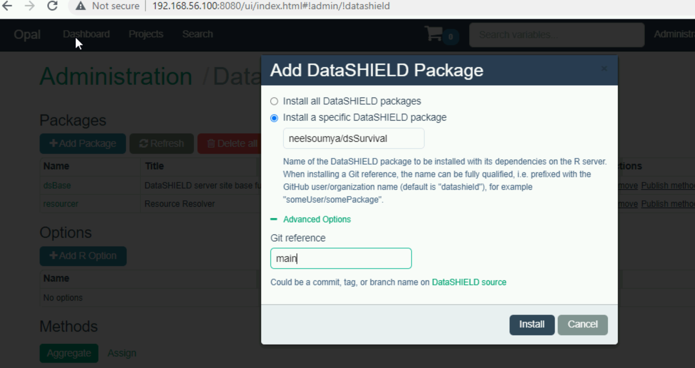
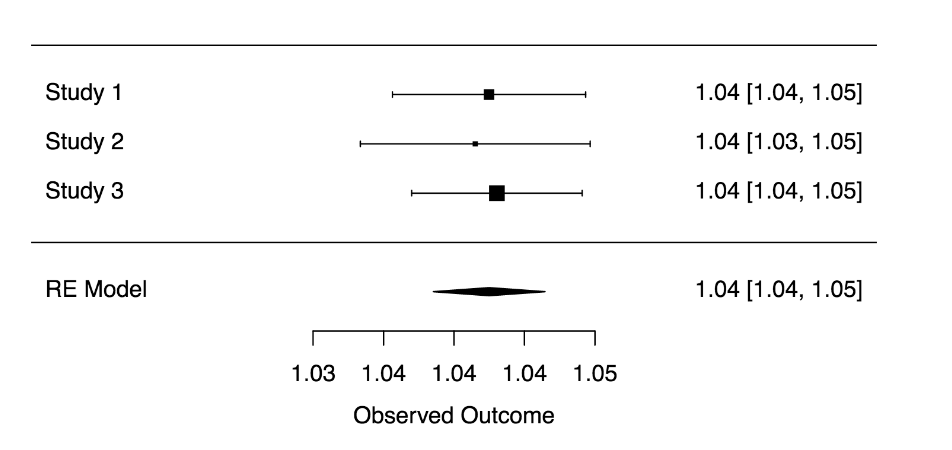

# dsSurvival

[](https://www.gnu.org/licenses/gpl-3.0.html)

## Introduction

`dsSurvival` is a package for building survival functions for DataSHIELD (a platform for federated analysis of private data). These are server side functions for survival models, Cox proportional hazards models and Cox regression models.

A tutorial in bookdown format with executable code is available here:

https://neelsoumya.github.io/dsSurvival_bookdown/


DataSHIELD is a platform for federated analysis of private data. DataSHIELD has a client-server architecture and this package has a client side and server side component.

* The client side package is called `dsSurvivalClient`:

    * https://github.com/neelsoumya/dsSurvivalClient

* The server side package is called `dsSurvival`:

    * https://github.com/neelsoumya/dsSurvival


## Quick start

* Install R 

   https://www.r-project.org/

and R Studio 

   https://www.rstudio.com/products/rstudio/download/preview/


* Install the following packages in R:


```r 
install.packages('devtools')
library(devtools)
devtools::install_github('neelsoumya/dsSurvivalClient')
devtools::install_github('datashield/dsBaseClient@6.1.1')
install.packages('rmarkdown')
install.packages('knitr')
install.packages('tinytex')
install.packages('metafor')
install.packages('DSOpal')
install.packages('DSI')
install.packages('opalr')
```


* Follow the tutorial in bookdown format with executable code and synthetic data:

https://neelsoumya.github.io/dsSurvival_bookdown/


## Installation


* Install R Studio and the development environment as described below:

    * https://data2knowledge.atlassian.net/wiki/spaces/DSDEV/pages/12943461/Getting+started


* Install the virtual machines as described below:

    * https://data2knowledge.atlassian.net/wiki/spaces/DSDEV/pages/931069953/Installation+Training+Hub-+DataSHIELD+v6

    * https://data2knowledge.atlassian.net/wiki/spaces/DSDEV/pages/1657634881/Testing+100+VM

    * https://data2knowledge.atlassian.net/wiki/spaces/DSDEV/pages/1657634898/Tutorial+6.1.0+100+VM

* Install dsBase and dsSurvival on Opal server in the Virtual Machine (type neelsoumya/dsSurvival and main in the textboxes) as shown in the screenshot below



If you have an older version of Opal, please use this version by Stuart Wheater

https://github.com/StuartWheater/dsSurvival

```r

install.packages('devtools')

library(devtools)

devtools::install_github('neelsoumya/dsBaseClient')

devtools::install_github('neelsoumya/dsSurvivalClient')

```

If you want to use a certain release then you can do the following

```r

library(devtools)

devtools::install_github('neelsoumya/dsSurvivalClient@v1.0.0')

```

If you want to try privacy preserving survival curves (work in progress and to be available in v2.0), then you can do the following

```r

library(devtools)

devtools::install_github('neelsoumya/dsSurvivalClient', ref = 'privacy_survival_curves')

```

## Usage


A tutorial with executable code in bookdown format is available here: 

https://neelsoumya.github.io/dsSurvival_bookdown/


A screenshot of the meta-analyzed hazard ratios from a survival model is shown below.




## Release notes

v1.0.0: A basic first release of survival models in DataSHIELD. This release has Cox proportional hazards models, summaries of models, diagnostics and the ability to meta-analyze hazard ratios. There is also capability to generate forest plots of meta-analyzed hazard ratios. This release supports study-level meta-analysis (SLMA).


A shiny graphical user interface for building survival models in DataSHIELD has also been created by Xavier Escriba Montagut and Juan Gonzalez. It uses dsSurvival and dsSurvivalClient.


* https://github.com/isglobal-brge/ShinyDataSHIELD

* https://isglobal-brge.github.io/ShinyDataSHIELD_bookdown/

* https://isglobal-brge.github.io/ShinyDataSHIELD_bookdown/functionalities.html#survival-analysis

* https://datashield-demo.obiba.org/


v2.0.0: Forthcoming. This will have privacy preserving survival curves.


## Acknowledgements

We acknowledge the help and support of the DataSHIELD technical team.
We are especially grateful to Elaine Smith, Stuart Wheater, Yannick Marcon, Paul Burton, Demetris Avraam, Patricia Ryser-Welch, Kevin Rue-Albrecht and Wolfgang Viechtbauer for fruitful discussions and feedback.


## Contact

* Soumya Banerjee, Demetris Avraam, Paul Burton, Xavier Escriba Montagut, Juan Gonzalez, Tom R. P. Bishop and DataSHIELD technical team

* sb2333@cam.ac.uk

* DataSHIELD 

    * DataSHIELD is a platform that enables the non-disclosive analysis of distributed sensitive data 

    * https://www.datashield.ac.uk


## Citation

If you use the code, please cite the following DOI

[](https://doi.org/10.5281/zenodo.4917552)


or see the CITATION.cff file created using

https://citation-file-format.github.io/cff-initializer-javascript/

